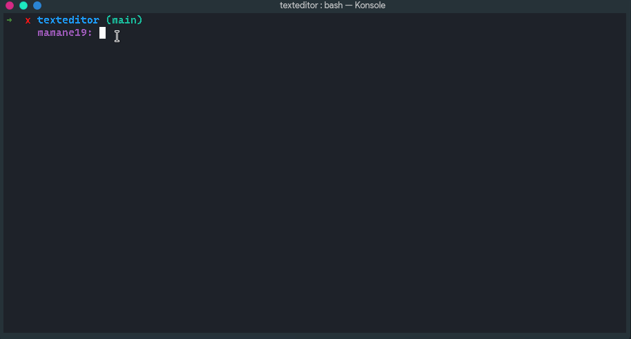

<h1 align="center">Text Editor Using Python</h1>

<p align="center">This program is a simple Text Editor. It uses  Tkinter packages to have a small GUI (Graphical User Interface) to write, edit, and save files (.txt). However you can save as .py or other type of files but, you can not edit them in the text editor as pyhton files or other type of files. Once you save the file you will see in your IDE that it is actually a python but by default it is a .txt file. (I will be working on this feature in the future). For now let's just have .txt files :) 
I also used a stack data structure for the undo and redo purposes. 
</p>

---
## Demo



## Getting Started
The program is structured using the [module architecture](https://www.tutorialspoint.com/python/python_modules.htm#:~:text=A%20module%20allows%20you%20to,file%20consisting%20of%20Python%20code) to make the code readabiliy very easy.

### Third party libraries:
- [tkinter](https://pypi.org/project/tkintertable/)

```
$pip install tkintertable
```
</br>
---

I recommend you to use a virtual environment to install those packages for you to not get your computer overwhelmed in terms of space. you can visit this [website](https://docs.python.org/3/library/venv.html) if you would like to do so. Note that it would not be a problem to run the program if you did not use a virtual environment.


To execute the program, run the entry-point file using the command inside the project directory:

```
$python textEditor.py
```
If you have multiple versions of python in your system, use the command bellow:
```
$python3 textEditor.py
```
